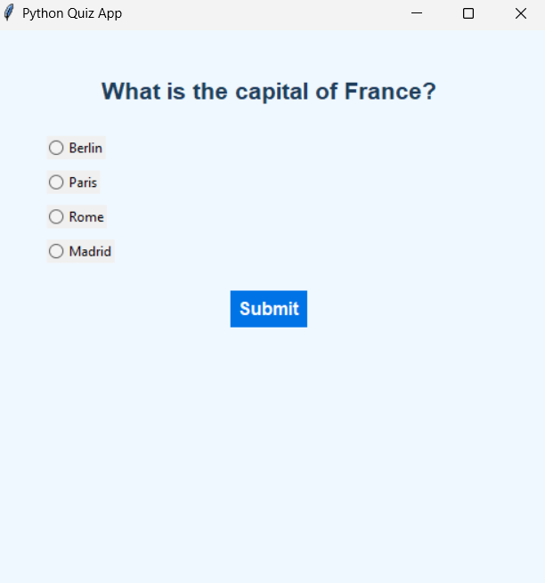
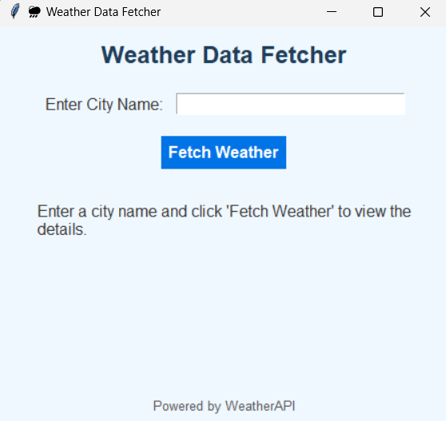
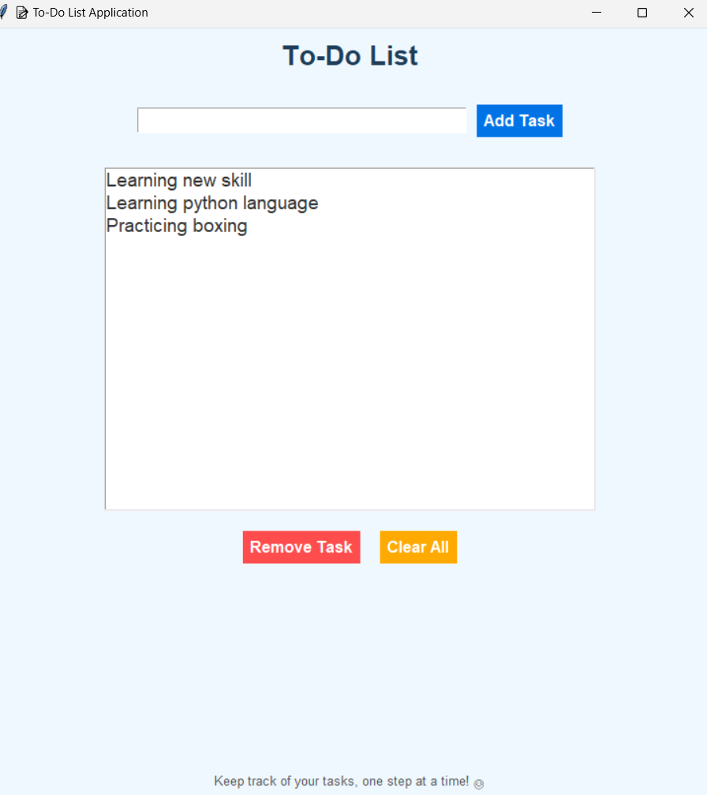
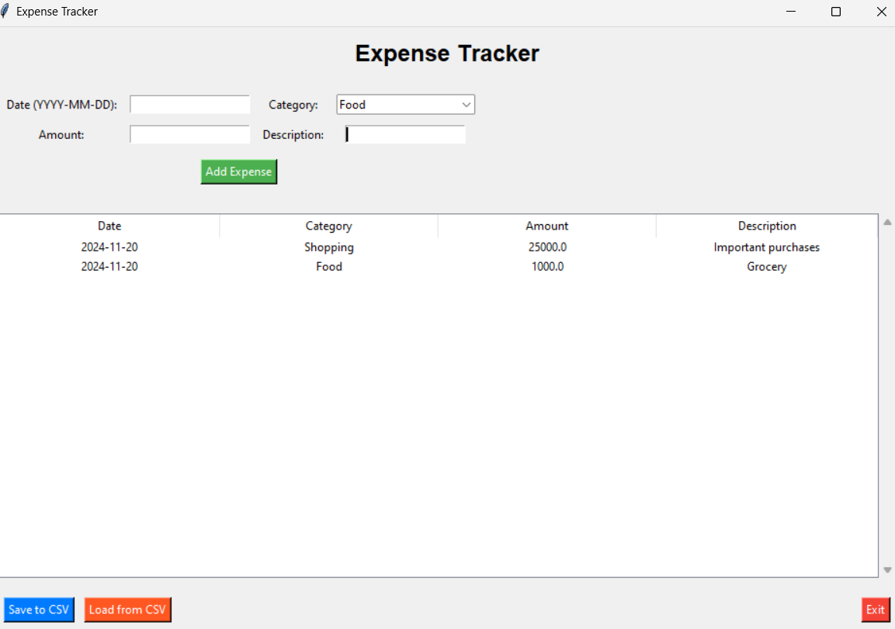

# 🌟 My GUI Projects Showcase

Welcome to my collection of GUI-based projects! Each project is carefully crafted to simplify and enhance everyday tasks. Feel free to explore them below:

## 🚀 Projects

### 1. [📚 Question Bank GUI](https://dhruvsinghmalik.github.io/question_bank-Gui/)  
Effortlessly manage and browse through a bank of questions.

---

### 2. [🌤 Weather App GUI](https://dhruvsinghmalik.github.io/Weather-Gui/)  
Stay updated with the latest weather conditions in your city.

---

### 3. [📝 Todo App GUI](https://dhruvsinghmalik.github.io/Todo-Gui/)  
Organize your tasks and never miss a deadline.

---

### 4. [💰 Expense Tracker GUI](https://dhruvsinghmalik.github.io/Expenses_traker-Gui/)  
Track your expenses with ease and stay on top of your finances.

